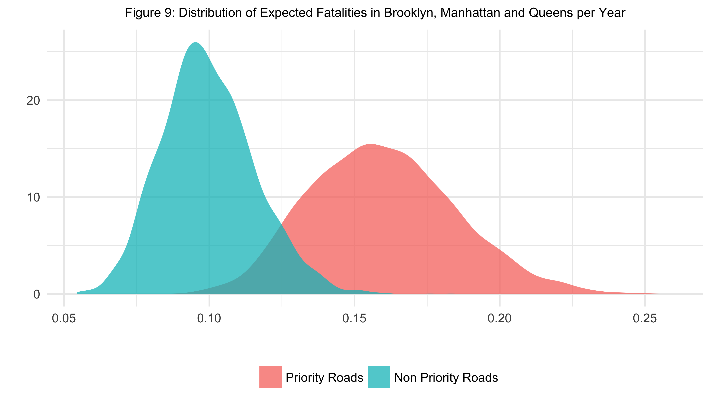

```{r setup, include=FALSE}
library("knitr")
library("rstan")
library("reshape2")
library("tikzDevice")
library('dplyr')
library('loo')
library("GGally")
rstan_options(auto_write = TRUE)
options(mc.cores = parallel::detectCores(), 
        tikzDefaultEngine = 'xetex')
theme_set(theme_light(base_size = 8))
load("data/data.RData")
```

\vfill

##Summary of Analysis

American cities spend billions of dollars deploying traffic safety 
countermeasures that reduce vehicle speeds and prevent pedestrian fatalities. 
However, the naïve before-after comparisons commonly used to evaluate the 
success of these countermeasures often suffer from selection bias. In this 
paper, we motivate why selection bias can cause policymakers to significantly 
overestimate the benefits of policy using New York City's Vision Zero program as 
an example. We demonstrate how the NASS General Estimates System (GES) and other 
traffic safety databases can be combined with a hierarchical model to produce a
more realistic picture of traffic safety policy. Finally, we use the results of 
this demonstration as evidence that New York City's estimate is optimistic, and 
a more reasonable estimate of the benefits of New York City's Vision Zero policy 
may be two-thirds the size originally claimed.

We would like to thank Roya Amjadi, Wendy Martinez, Stas Kolenikov and the 
American Statistical Association's Government Statistics Section for their 
encouragement. We would also like to thank members of Community Board 7, 
including Richard Robbins and Catherine DeLazzero for their knowledge and 
expertise.

\newpage

##I. Introduction
   
###Vision Zero Policy in Theory and Practice

Researchers cite motor vehicle collisions as a leading source of preventable 
death in the United States [@mokdad2004actual]. Thirty five thousand Americans 
were killed by motor vehicles in 2013. This exceeds the number of fatalities 
from more controversial causes such as firearms and alcohol. There were 34,000 
deaths from firearms injuries and twenty-nine thousand deaths induced by alcohol 
in 2013 [@xu2010national]. Yet gun and alcohol related deaths receive a 
significantly larger portion of the public’s attention.
 
The difference between collisions and guns or alcohol is that policymakers have 
historically considered fatalities from motor vehicle collisions unavoidable. 
In fact, traditional road design manuals intended for highways explicitly 
recognized a tradeoff between safety and mobility. Engineers were instructed to 
build roads to accommodate the projected traffic volume and reduce bottlenecks. 
For example, urban arterials were designed to achieve a traffic flow of 30 to 60 
mph [@aashto2001policy]. Policymakers then set speed limits to the 85th 
percentile speed of drivers observed in favorable operating conditions. This 
speed was considered a reasonable balance of safety and mobility, and drivers 
were expected to reduce their speed only when unfavorable operating conditions 
produced increased risk [@national1998managing].
 
An increasing number of American cities have since found the traditional 
approach inadequate because drivers in urban areas are seldom able to identify 
the unfavorable operating conditions that put more vulnerable road users like 
pedestrians or bikers at increased risk[^1]. In 2014, fifteen percent of motor 
vehicle fatalities were pedestrians, and seventy-eight percent of those 
fatalities occurred in urban areas [@trafficfacts2016]. Many cities have since 
established countermeasures that encourage road users to make safer decisions. 
The policies are collectively known as Vision Zero and have a stated goal of 
creating a road system with zero traffic fatalities.

Vision Zero originated as a comprehensive, long-term infrastructure investment 
strategy that rejects the traditional balance of safety and mobility. It 
prioritizes safety over mobility by anticipating human error and then slowing 
vehicles to the safest possible travel speed. The success of this strategy is 
guaranteed by physics: slower vehicles collide with less force and are therefore 
less likely to kill a pedestrian. Citywide road redesign that actively slows 
vehicles is therefore integral to the Vision Zero strategy as originally 
conceived [@tingvall2000vision].[^2]  

Although theoretically effective, road redesign has proven costly to implement 
and challenging to sustain across an entire city. An expedient albeit less 
effective countermeasure is to simply mandate that vehicles reduce their travel 
speed by lowering the posted speed limit below the speed for which the road was 
originally designed [@leaf1999literature]. The posted speed limit can be reduced 
immediately and at relatively little cost, and the reduction ostensibly affects 
every vehicle across an entire city. 

Needless to say a posted speed limit without commensurate levels of design, 
enforcement and outreach is unlikely to achieve the Vision Zero goal because 
drivers have little incentive to reduce their speed in compliance with the lower 
limit [@leaf1999literature]. But making these improvements provides no 
guarantee. The National Highway Safety Traffic Administration rates the 
countermeasure “reduce and enforce speed limits” three out of five stars for 
improving safety because research indicates that actual speed is reduced by only 
a fraction of the lowered amount, typically 1-2 miles per hour (mph) for every 5 
mph reduced. It states in no uncertain terms that effectiveness requires the 
reduced limit be met with communications and outreach, enforcement and 
engineering changes. It warns that merely changing speed limits is of limited 
effectiveness [@goodwin2010countermeasures].

Nevertheless, Vision Zero advocates promise American cities huge reductions in 
fatalities when speed limits are lowered as part of a larger Vision Zero 
strategy. Many cite European countries like Sweden, which pioneered the Vision 
Zero movement with partnerships between industry and government in the mid-1990s 
[@SwedGov2016]. Sweden took steps such as reducing the speed limit, separating 
traffic lanes and erecting barriers. Fatalities fell from 6 to 4.7 deaths per 
100,000 residents [@johansson2009vision], meanwhile the United States continued 
to experience 11 deaths per 100,000 residents in 2013.

Twelve major American cities have since set a Vision Zero strategy: Chicago, 
San Francisco, New York City, Boston, Los Angeles, Austin, Portland, 
Seattle, San Jose, San Diego, Washington D.C. and Denver. The majority of these 
strategies include adjustments to many or all of the posted speed limits. For 
example, New York City lowered the default citywide speed limit from 30 to 
25 mph in late 2014. San Francisco uniformly set the speed limit around schools 
to 15 mph, and is considering a citywide speed limit of 20 mph at the time of 
this paper. The policy question is whether these reductions are nominal 
legislative changes or whether vehicle speed has been lowered enough to 
meaningfully diminish the probability a collision results in a pedestrian 
fatality.

###Selection Effects Bias Before-After Comparisons

The Vision Zero goal of zero fatalities offers little direction on how to 
evaluate Vision Zero policies because any death prevents a city from achieving
this goal. However, traffic safety policy has significant economic and quality 
of life costs to city pedestrians, and the success of Vision Zero policies to 
meaningfully reduce fatalities might best be evaluated within this context. For 
example, the U.S. Department of Transportation directs it offices to assign 
human life a value of around $10 million when conducting analysis that carries 
implications for public safety [@lifevalue2016]. Thus from a cost-benefit 
perspective, the billions of dollars invested on countermeasures by American 
cities annually might be considered successful if it were to save hundreds of 
lives. Unfortunately, even a vague estimate of the number of lives saved from 
traffic safety improvements is notoriously difficult to estimate as we 
illustrate in the present section. @hauer2005cause and @davis2000accident 
provide extended discussions.

Traffic safety research relies predominantly on before-after comparisons to 
evaluate policy in lieu of randomization, the standard of experimental research. 
A before-after comparison simply examines the outcome of a policy before and 
after its implementation and attributes any change to the policy, after possible 
adjustment. The key assumption is that the before period reflects the outcome 
one would expect had the policy never occurred. A before-after comparison can be 
made in various ways, and the exact formulation is generally a matter of taste. 
Popular with traffic safety researchers are modification factors that measure 
the ratio of the outcome after the policy to before. The FHWA Highway Safety 
Manual evaluates policy in this way. We work instead with the reduction factor, 
which measure the difference between the before and after outcomes. Policymakers 
more commonly report this measure.

We describe a typical before-after comparison using New York City’s Vision Zero 
strategy [@vzthree]. This description motivates the major limitation of 
before-after comparisons. Throughout this section and the remainder of the paper
we consider only pedestrian fatalities.

In November 2014, New York City reduced the citywide default speed limit from 
30 to 25 mph. The City Department of Transportation and Police Department 
established a committee tasked with enforcing the speed limit in key areas. To
determine these areas, the committee reviewed the location of vehicle-related 
fatalities and serious injuries between the years 2009 and 2013. These locations 
were then prioritized for Vision Zero engineering, enforcement and education 
changes. Using the road shapefile provided by the New York State GIS Program 
Office,[^3] we estimate 44,337 road segments or about 32 percent of New York 
City road segments were prioritized. We found these road segments made up 
roughly 70 percent of pedestrian fatalities between 2009-2013.[^4]

The priority locations are visualized for midtown Manhattan Figure 1. The blue 
shaded region is the priority area, the blue lines are the priority corridors 
and the blue triangles are the priority intersections. Blue dots depict 
fatalities falling within priority locations. Red dots depict fatalities falling 
outside priority locations. 

Fatalities are displayed in Figure 1, panel 1 for the last review year, 2013, 
and in panel 2 for the year 2016. These years correspond to a before-after 
comparison reported by the committee as evidence that Vision Zero was 
successful. The committee noticed that over the 2009-2013 period, an average of 
99 pedestrian fatalities occurred at priority locations throughout the city each 
year. In 2016 there were only 72 fatalities at these locations, a 27 percent 
decline. They concluded this decrease was due to the changes made since 2015 
[@vzthree]. 

 

The annual number of fatalities from 2009 to 2016 is displayed in Figure 2, and 
the city’s conclusion is reflected in the first panel that only includes road 
segments in priority locations. For the present discussion, we interpret the 
committee’s claim that Vision Zero policy caused the reduction from an average 
of 99 to 72 deaths as a statement regarding the average treatment effects in the 
potential outcomes framework of @imbens2015causal. That is, 27 deaths were 
averted in 2016 because of Vision Zero policies in the sense that we expect 
these deaths would have occurred had the before period level of traffic safety 
been maintained and not improved. Furthermore, we presume the claim is stating 
that this reduction is similar to the level of fatalities the city can expect in 
future years when similar roads segments in other parts of the city are treated 
in a similar manner.[^5]

A simple thought experiment using results from the traffic safety literature 
suggests this interpretation is optimistic but not impossible. Suppose for 
simplicity all vehicles traveled uniformly at 30 mph before the City reduced its
default speed limit. The National Highway Safety Traffic Administration 
estimates that a 5 mph reduction of the speed limit reduces vehicle speeds by 
1-2 mph. Assuming every priority road achieved the maximum reduction in vehicle 
speeds, a new speed limit of 25 mph would lower vehicle speeds to 28 mph. 
According to @rosen2009pedestrian,[^6] this 2 mph change in vehicle speed would 
yield a fatality reduction of 24 percent, 3 percentage points lower than the 
decrease suggested by New York City's Vision Zero committee. The maximal 
attainable reduction can be seen as 50 percent, the decrease in fatalities if 
the city might potentially achieve were it able to successfully reduce vehicles 
to the posted limit of 25 mph.

The second two panels in Figure 2 indicates the extent to which the 27 percent 
reduction in fatalities cited by the Vision Zero committee likely overstates the 
success of Vision Zero policies. It shows that from the 2009-2013 before period 
to the 2016 after period, fatalities in non-priority locations increased 
by 20 percent, roughly the same magnitude as fatalities in priority locations 
decreased. Moreover, little change in the total number of pedestrian fatalities 
occurred over the rollout of New York City’s Vision Zero program from 2014 to 
2016 as demonstrated in the third panel of Figure 2. This striking antiparallel 
behavior among priority and nonpriority roads and relatively minor progress in 
reducing fatalities as a whole over the last few years suggests the procedure 
used by New York City to select priority roads, and not the Vision Zero program 
itself, accounts for a significant portion of the observed changes as in the 
following scenario.

 

We know the committee chose priority roads with abnormally large numbers of 
fatalities. It is likely some portion of the fatality rate on the selected roads 
was due to dangerous conditions in need of repair and some portion was due to 
coincidence and unlikely to repeat itself. The fact that as many as 139 thousand 
street segments could have been selected as priority indicates that perhaps a 
sizable portion of fatalities on priority roads were coincidence. The fatalities 
on these roads would be unlikely to repeat themselves, and as a result, the 
total number of fatalities over the group of roads would revert from the 
abnormally high levels of the before period to the city-wide mean when measured 
in subsequent years, regardless of any intervening policy. A similar behavior 
could be ascribed to the unselected roads segments: these had abnormally low 
numbers of fatalities and were expected to see a rise, regardless of policy. 

If true, the before measurement is higher than what we would expect in both 
the 2009-2013 period and in subsequent years had the same levels of traffic 
safety policy been maintained. This violates the key assumption that the before 
period reflects the outcome one would expect had the policy never occurred. As a 
result, the before-after comparison of priority roads may overstate the causal 
effect of the Vision Zero policy. The exaggeration of the estimated effect of
Vision Zero policy in this manner is often referred to as selection bias since 
the Vision Zero committee selected roads more likely to have a subsequent 
reduction in fatalities.

###Nonparametric Empirical Bayes Adjustment for Selection Bias 

Recognition of regression effects and selection bias lie at the foundation of 
modern statistical practice [@stigler2016seven, see pg. 139 for the cautionary 
tale of Horace Secrist]. Moreover, traffic safety policy, along with students’ 
test scores and parent/children heights, have long served as a prime example. It 
is no surprise then that many statisticians have offered corrections. Among the 
most famous is Herbert Robbins', who even considered the exact problem of 
selection bias in before-after studies (see for example, 
@robbins1988estimating). His Empirical Bayes approach borrows information 
cross-sectionally, across units researchers might normally consider 
incomparable, to construct more realistic expectations. Its success comes from 
the recognition that, while the units themselves may be different, the ways in 
which they vary are systematic and can thus be characterized. For a concrete 
example, consider the hierarchical model:

\begin{align*} 
X_i       &\sim \text{Poisson} (\lambda_i) \\
\lambda_i &\sim \text{g} (\theta) 
\end{align*}

In the context of New York City's Vision Zero policy, $X_i$ denotes the 
number of pedestrian fatalities on road segment $i$ in any year between 
2009-2013. The rate parameter of each road segment, $\lambda_i$, is thought 
exchangeable and modeled i.i.d. $g(\theta)$. The reader may wish to interpret 
this hierarchy as describing how road segments might themselves be chosen from a 
superpopulation of road segments that a city could build. Denoting $I$ as the 
set of all priority road segments, we write the expected number of pedestrian 
fatalities on these road segments under the 2009-2013 policy after observing the 
number of fatalities from 2009-2013 as
$E (\sum_{i \in I} \lambda_i | X_i) = \sum_{i \in I} E (\lambda_i | X_i)$. Each
individual $E (\lambda_i | X_i)$ is estimable using Robbins' formula 
[@efron2016computer]:

$$\hat{E} ( \lambda_i | X_i) = (X_i + 1) \frac{\sum_j X_j \mathbbm{1}(X_j= X_i + 1)}{\sum_j X_j \mathbbm{1}(X_j= X_i)}$$

This estimate was originally suggested by Alan Turing as a solution to the 
similar Missing Species Problem of @good1953population, but named after Herbert 
Robbins who extensively studdied its properties [@robbins1955empirical,
@robbins2000efficiency]. Its appeal comes primarily from the fact that no 
restrictions have been placed on the prior/population distribution, $g(\theta)$.

Table 1 applies Robbins' formula to the Vision Zero data. The first row, <1> 
prints the total number of road segments in New York City by the number of 
fatalities. For example, there were 138,142 segments with no fatalities, 632 
with one fatality, and so on. These were plugged into Robbins' Formula to get 
<2>, the expected number of fatalities on each road segment given the number of 
fatalities observed. This was then multiplied by <3>, the number of road 
segments selected by the Vision Zero committee as priority locations, yielding 
<4>, the number of fatalities on priority road segments we would expect over a 
five year period if there were no policy changes. Summing and dividing by the 
number of years in the 2009-2013 period gives an average of 52 deaths. 
Thus despite observing an average of 99 deaths in priority locations over
the 2009-2013 period, we estimate an average of 52 fatalities a year in these
locations.

| Observed Number of Fatalities     |   0     |    1  |   2  | 3 |
|-----------------------------------|---------|-------|------|---|
| <1> Number of Road Segments       | 138,142 |  632  | 40   | 1 |
| <2> Estimated Fatality Rate       | .0045   | .1266 | .075 | 4 |
| <3> Number of Priority Segments   | 43,806  |  405  | 29   | 1 |  
| <4> Expected Number of Fatalities | 200     |  51   | 2    | 4 | 

Table: Application of Robbins' Formula to the New York City Vision Zero data

This expectation of 52 fatalities per year in the priority locations is 
substantially lower than the 73 fatalities actually observed in 2016 after 
Vision Zero changes. Robbins' formula reports more fatalities in priority 
locations have occurred than would be expected if the previous policy had been 
maintained, not less, as claimed by the Vision Zero committee. Moreover, this 
increase is massive. It implies the percent increase in the average number of 
deaths from the 2009-2013 before period to the 2016 after period would be a 
whopping 27 percent. 

Yet we believe this 27 percent increase is potentially as pessimistic as the 
number estimated by the New York City committee is optimistic. Nothing in the 
traffic safety literature indicates that any of the countermeasures employed 
should substantially increase the number of fatalities. More likely, we have too
readily compared New York City priority road segments with nonpriority road 
segments when in reality the two might be quite disparate.[^7] Unfortunately, 
it is difficult to gauge how pessimistic this adjustment actually is without 
additional information or imposing additional structure. 

We conclude that the inclusion of prior information with an interpretable model 
is necessary to reliably estimate the benefits of traffic safety policy aimed at 
reducing vehicle speed in major American cities. Indeed, this is the objective
of our analysis. We turn to hierarchical Bayes, which favores comparably with 
empirical Bayes, even without the inclusion of structural prior information 
[@berger2013statistical]. Nevertheless, we use the vast quantity of traffic 
safety data available to group road segments by various types. We assume that 
roads segments are exchangeable within type, allowing us to easily quantify the 
sources of variation which contribute to the fatality rate. 

Contrary to the Nonparametric Empirical Bayes analysis, we find evidence that 
Vision Zero policy did decrease the number of fatalities. However, there is much 
uncertainty surrounding the increase, and reductions ranging from negligable to
the size claimed by the Vision Zero committee are plausible. Yet we believe it 
is reasonable to state that the decrease is roughly two-thirds the size claimed 
by the Vision Zero committee.

[^1]: Often collisions involving pedestrians occur in the middle of the road at 
night [@trafficfacts2016], perhaps indicating that drivers frequently fail to 
notice jaywalking pedestrians. Nevertheless, the driver is found at least 
partially responsible in the vast majority of these collisions.

[^2]: Vision Zero and the traditional approach can differ substantially. 
For example, traditional traffic safety improvements often widen roads and 
crosswalks to aid evasive maneuvers that reduce collisions, while Vision Zero 
advocates improvements that narrow them, much like the road "diets" of 
@goodwin2010countermeasures, to force drivers to decrease their vehicle speed. 
Consequently, reducing fatalities under the Vision Zero approach may actually 
increase the number of collisions. For details see @johansson2009vision.

[^3]: https://gis.ny.gov/aboutus/

[^4]: Our visualizations differ from New York City’s Vision Zero evaluation, 
possibly because of different data sources, although we notice no difference in 
the conclusions. Our data is from the Department of Transportation’s data feed 
http://www.nyc.gov/html/dot/html/about/vz_datafeeds.shtml.

[^5]: This is not exactly equivalent to the key assumption of the before-after 
analysis that the before period reflect the fatality rate had the policy never 
happened because we would still expect investment and depreciation of road 
segments. We point out that our model could be adapted for a 
difference-in-difference analysis, which would more accurately reflect the 
benefit of the policy. However, this is not the comparison made by 
New York City's Vision Zero committee and would move us away from the more
basic before-after comparisons that are the subject of this paper and more 
typically relied upon by policymakers.

[^6]: @rosen2009pedestrian look at the probability of a fatality following a 
collision on roads in Germany that may differ from roads and customs in New York 
City. Moreover, Vision Zero improvements may increase the number of collisions,
moderating the benefits of a lower speed. Traffic safety improvements sometimes
distractions which could potentially account for a lower fatality rate without
reducing vehicle speed.

[^7]: It is unlikely all 44,337 road segments in New York City were eligible to 
be priority locations. For example, it may be unrealistic to include road 
segments on the periphery of the city.

##II. Selecting Predictors of Pedestrian Fatalities

The previous section motivated the need to incorporate additional information 
about road segments into our estimate of the fatality rate before the 
introduction of Vision Zero policy. We suspect qualitative differences between 
road segments, such as the number of lanes or the existence of a protective 
median, are disproportionately distributed across priority and nonpriority 
roads. It was unclear how such information could be integrated into Robbins' 
formula to yield a more reliable and interpretable estimate of the benefits of 
Vision Zero policy. Our contribution can best be seen as full Bayes extension of 
the hierarchical model from the previous section that adds qualitative 
details to $g(\theta)$ informative of fatalities.

Covariates that represent major sources of variation in pedestrian fatalities 
are without a doubt important. These covariates determined the selection 
procedure used by the Vision Zero committee and subsequently confound the 
evaluation of priority locations in the before-after comparison. But experts 
disagree on which variables are most important and their exact mathematical 
relationship with each other and the fatality rate. An interpretable model will 
allow us to evaluate which covariates are important and improve the model. We 
presume the relationships between these important covariates and fatalities will 
persist across years and cities, and we jointly model fatalities from the twelve 
major American cities that have declared Vision Zero policies in order to better 
understand these relationships.

Our primary dataset in this endeavor is the National Automotive Sampling System 
(NASS) General Estimates System (GES) collected by the National Highway Traffic 
Safety Administration. Multiple datasets of fatalities and covariates 
informative of fatalities exist across many different government entities. For 
example, our motivating example relied upon fatality data from New York City 
Department of Transportation's fatality database and road segment data from New 
York State's GIS Program Office. However, these datasets contain few informative 
covariates, and many of these covariates only cover specific regions within 
cities and are subject to coding standards that render them incomparable across 
regions. Datasets that do contain standardized information across multiple 
cities are largely retrospective since fatalities are rare, and it is easier to 
collect information after a fatality has occurred than to continuously update 
information about roads. 

Fortunately, the GES is a nationally representative probability sample selected 
from the more than five million police-reported crashes that occur annually. To 
our knowledge it is the only prospective measure of fatality risk that contains 
a large number of covariates detailing the road, vehicle and persons involved. 
For additional details on the GES, see Roya et al. (XXXX). We combine the 
[GES](ftp://ftp.nhtsa.dot.gov/GES) with the Fatality Analysis 
Reporting System, ([FARS](ftp://ftp.nhtsa.dot.gov/fars/)), a retrospective census 
of fatalities with similar covariates. The main appeal of FARS is the inclusion 
of identifying information, like geographic coordinates, that allow us to 
estimate traffic and pedestrian density and use our inferences to evaluate New 
York City's priority roads segments as discussed in the Introduction.

Our combination of GES and FARS has a strong connection to the multilevel 
regression and poststratification approach popular in the survey literature
[@gelman1997poststratification], [@gelman2006data], and perhaps it can be best 
motivated with an analogy to survey sampling. We think of the weighted GES data
as a representative sample of road segments by type, where type is determined by 
levels of select covariates. FARS is, in contrast, a convenience survey of road 
segments, which oversamples roads with covariate levels predictive of the 
outcome of interest: fatalities. This oversampling allows us to better 
understand the covariates predictive of fatalities, which we quantify a 
hierarchical model. In this capacity, the GES serves as a Rosetta Stone, 
allowing us to re-adjust retrospective information to reflect a desired 
population of road segments. 

Re-adjustment follows directly from the Law of Total Expectation. Let $X_i$ be 
the number of fatalities on the $i^{th}$ road segment, 
$X_i \in \{0, \ldots, \infty \}$ and $Z_i$ the "type" of the $i^{th}$ road 
segment, $Z_i \in \{0, \ldots, M \}$. Then by the Law of Total Expectation,

\begin{align*}
\mathbb{E}(X_i| X_i \geq 1, Z_i =z) \mathbb{P}(X_i \geq 1 | Z_i =z) &= \mathbb{E}(X_i| X_i \geq 1, Z_i =z) \mathbb{P}(X_i \geq 1 | Z_i =z)  + 0 \\
&= \mathbb{E}(X_i| X_i \geq 1, Z_i =z) \mathbb{P}(X_i \geq 1 | Z_i =z) + \mathbb{E}(X_i| X_i = 0, Z_i =z) \mathbb{P}(X_i = 0 | Z_i =z) \\
&= \mathbb{E} ( \mathbb{E}(X_i| X_i \geq 1, Z_i =z)| X_i \geq 1) \\
&= \mathbb{E}(X_i| Z_i =z)
\end{align*}

Our goal is to estimate $\mathbb{E}(X_i| Z_i =z)$. We arrive at this quantity by
estimating $\mathbb{P}(X_i \geq 1 | Z_i = z)$ from the GES using the empirical 
probability of a fatality on each road type  
$\sum_i \mathbbm{1}(X_i \geq 1 , Z_i = z)/\sum_i \mathbbm{1}(Z_i = z)$ and  
$\mathbb{E}(X_i| X_i \geq 1, Z_i = z)$ with a hierarchical model detailed in 
the following section. The empirical estimate of 
$\mathbb{P}(X_i \geq 1 | Z_i = z)$ is conditional on the event that the road 
segment type is included in the GES sample. Since every collision on every road
segment could potentially be included in the GES sample, we use the GES 
stratified-sampling scheme referred to in the GES Users' Manual to adjust 
the probability for unconditional estimates. Reversing this weighting procedure 
for a different region yields the expected number of fatalities over that 
region. Indeed, we will use this procedure to obtain the expected number of 
fatalities for New York City priority road segments.

The success of this strategy depends on the whether roads segments are 
believably exchangeable given covariate levels, and thus the road segments 
within the FARS convenience sample are representative of all road segments with 
those covariate levels. This assumption is considered essentially satisfied if 
there is far more variation between covariate levels than within covariate 
levels. We evaluate the plausibility of this assumption with an Analysis
of Variance in the following section.

We conclude this section by briefly noting several additions to the final 
dataset used for this analysis. Missing New York City speed limit data in FARS 
is imputed from 
[NYC DOT](http://www.nyc.gov/html/dot/html/about/datafeeds.shtml) 
using the shapefiles of speed limits. The pedestrian population on each road was
estimated following the recommendations of the 
[Census Bureau](https://www.census.gov/hhes/commuting/data/calculations.html) 
using the Census Tract Flows 
[(TPP)](https://www.fhwa.dot.gov/planning/census_issues/ctpp/data_products/2006-2010_tract_flows/) 
and the Census Planning Database 
[(PDB)](http://www.census.gov/research/data/planning_database/). 
Average annual daily traffic was estimated from the Highway Performance 
Monitoring System 
[(HPMS)](http://www.fhwa.dot.gov/policyinformation/hpms/shapefiles.cfm).

The final dataset contains 2,404 fatalities as determined by the KABCO Scale. 
[^8] It includes every pedestrian death in the twelve major American cities with 
some version of a Vision Zero policy between 2010 and 2015 for which there was 
no missing covariate information that could be reliably estimated with 
additional resources. We assume missingness results from unintentional oversight 
and therefore is missing at random. The year 2009 was dropped because of 
compatibility issues between GES and FARS.

###Summary of Dataset

The dataset has the following eight qualitative variables describing each road
segment: the weather and surface condition (COND), the city (CITY), the year
(YEAR), the posted speed limit (SLIM), the presence of various signs or signals
(SIGN), the time and lighting (LGHT), the physical road characteristics or built
environment (BLTE) and the annual average traffic density (TFFC). The first six 
observations of the dataset are displayed in Table 2 below. These variables can 
be thought of as batches of covariates that characterize road segments. 

Conversations with experts indicated that these batches express covariates 
with similar amounts of informativeness a priori. For example, CITY denotes 
which of the twelve cities contains the road segment, and we expect the 
contribution of the fatality rate due to the city containing the road segment to 
vary systematically about the average city level. Interactions between the 
categories are likely, but the same conversations suggested that their 
importance is second order, and a cursory analysis might exclude them entirely. 
The dataset also has one quantitative variable: the number of pedestrians 
exposed to the road segment (EXPR). Sampling weights were not used in the 
hierarchical model and are excluded from the discussion of the current section.

Table 3 shows the number of observations within the most common qualitative 
variable levels. A few of these qualitative variables possess a large number of 
categories. COND, LGHT and BLTE have 25, 36 and 111 categories respectively, and 
most of these categories are well represented. For example, New York City 
(city 12) had around 800 road segments and many roads are observed in weather 
condition 2 (clear weather, dry road surface). But while the marginal counts of 
each category can be large, the number of observations within interactions, or 
combinations of categories, quickly dwindles as the following three figures 
demonstrate.

```{r summary, warning = FALSE, message = FALSE, echo = FALSE}
crash_data <-
  data.frame(stan_dat[,#sample(1:nrow(stan_dat),6),
                      c("COND","CITY","YEAR","SLIM","SIGN",
                        "LGHT","BLTE","TFFC","EXPR")])
kable(round(head(crash_data),2),caption="Example Observations of Dataset")
kable(summary(apply(crash_data[,1:8],2,factor)),caption="Summary of Dataset")
```

Figure 3.1 plots a histogram of the observations by city. Figure 3.2 plots these
cities by the most common speed limits, and Figure 3.3 plots them by both the
most common speed limit and the last four years of the dataset. Cities are
arranged from smallest population at the top to largest population at the bottom
(as of the 2010 Census). In the interaction between speed limit, city and year,
the largest cell only has 150 observations, and the vast majority has less than
10 observations. And this does not even include the larger categories COND, LGHT
and BLTE.

```{r explore, warning = FALSE, message = FALSE, echo = FALSE}
city_labels <- factor(crash_data$CITY,labels=c(
    "Washington D.C.","Boston","Austin","Denver","Portland","Chicago",
    "Seattle","Los Angeles","San Diego","San Francisco","San Jose",
    "New York City"))
city_labels <- factor(city_labels,
    levels=levels(city_labels)[c(12,8,6,9,11,3,10,7,4,1,2,5)])
crash_viz <- crash_data; crash_viz$city_labels <- city_labels

ggplot(crash_viz) +
  theme(plot.title = element_text(size=9, hjust = .5),
        plot.caption = element_text(hjust = 1)) +
  aes(city_labels) +
  geom_histogram(stat="count") +
  coord_flip() +
  scale_y_continuous(expand = c(0, 0)) +
  labs(x="",y="", 
   title="Figure 3.1: Number of Observations per City",
   caption = paste("This figure exhibits the number of deaths in each Vision Zero city",
              "over the 2010 to 2015 sample period. Cities are arranged in increasing",
              "order \nof population. The number of fatalities corresponds loosely",
              "with population size."))

ggplot(crash_viz[crash_viz$SLIM %in% 5:8,]) +
  theme(plot.title = element_text(size=9, hjust = .5),
        plot.caption = element_text(hjust = 1)) +
  aes(city_labels) +
  geom_histogram(stat="count") +
  coord_flip() +
  labs(x="",y="") +
  facet_wrap(~factor(SLIM,labels = c("20 MPH","25 MPH","30 MPH","35 MPH"))) +
  scale_y_continuous(expand = c(0, 0)) +
  labs(x="",y="", 
   title="Figure 3.2: Number of Observations per City by Posted Speed Limit",
   caption = paste("This figure exhibits the number of deaths in each Vision Zero city",
              "over the 2010 to 2015 sample period stratified by whether the posted",
              "speed \nlimit on the road was 20, 25, 30 or 35 MPH. Cities are",
              "arranged in increasing order of population. Speed limits of 25, 30 and", 
              "35 are observed \nfor every major city."))

ggplot(crash_viz[crash_viz$SLIM %in% 6:8 &
                 crash_viz$YEAR %in% 3:6,]) +
  theme(plot.title = element_text(size=9, hjust = .5),
        plot.caption = element_text(hjust = 1)) +
  aes(city_labels) +
  geom_histogram(stat="count") +
  coord_flip() +
  labs(x="",y="") +
  facet_grid(factor(YEAR,labels = c("2012","2013","2014","2015"))~
             factor(SLIM,labels = c("25 MPH","30 MPH","35 MPH"))) +
  scale_y_continuous(expand = c(0, 0)) +
  labs(x="",y="", 
   title="Figure 3.3: Number of Observations per City by Posted Speed Limit and Year",
   caption = paste("This figure exhibits the number of deaths in each Vision Zero city",
              "over the 2012 to 2015 sample period stratified by the year each",
              "fatality took \nplace and whether the posted speed limit on the road",
              "was 25, 30 or 35 MPH. Cities are arranged in increasing order of",
              "population. Speed \nlimits of 25, 30 and 35 are not observed for every", 
              "major city in every year."))
```

```{r colinearity, warning = FALSE, message = FALSE, fig.align="center", echo = FALSE}
cramer.v <- function(X1,X2)
  sqrt(chisq.test(X1, X2)$statistic / ((length(X1) *
      (min(length(unique(X1)),length(unique(X2))) - 1))))
cor_mat <- matrix(ncol = 8, nrow = 8, 
                  dimnames = list(colnames(crash_data)[1:8],
                                  colnames(crash_data)[1:8]))
for(i in 1:8) for(j in 1:8) cor_mat[i,j] <-
  cramer.v(factor(crash_data[,i]),factor(crash_data[,j]))

ggcorr(data=NULL,cor_matrix = cor_mat, 
       low = "steelblue", mid = "white", high = "darkred",
       label = TRUE, label_size = 3, size = 3) + theme_void() + 
  theme(
        plot.title = element_text(size=9, hjust = 0),
        plot.caption = element_text(size = 7, hjust = 1), 
        legend.position = "none") +
  labs(
   title="Figure 4.1: Correlation of Qualitative Variables using Cramer's V",
   caption = paste("This figure exhibits the marginal correlation",
              "of the eight qualitative variables using Cramer's V statistic.",
              "\nA value of 0 indicates that the two variables have little",
              "association, and a value of 1 indicates that the \ntwo variables",
              "are equal to each other. From this figure we observe that nearly all of the",
              "variables are \nmoderately associated. The largest association exists",
              "between the city and traffic density."))
```

Low counts within combinations of the categorical variables can lead to 
instability and interpretability issues if the categorical variables are highly 
associated. We summarize the pairwise association of the eight qualitative 
variables using Cramer's V statistic in Figure 4.1. We find that no two 
covariates, aside from year and traffic density, are highly associated although 
nearly every covariate exhibits moderate association. This suggests we can 
proceed with all eight qualitative variables in our initial model. The high 
associations in Figure 4.2 warns that we must be judicious in deciding among 
interactions between the categories because the interaction terms are highly 
associated with each other.

```{r colinearity_int, warning = FALSE, message = FALSE, fig.align="center", echo = FALSE}
crash_data_int <- crash_data
crash_data_int <- rbind(crash_data_int,crash_data_int[crash_data_int$YEAR==6,])
crash_data_int$SLIM_actual <- crash_data_int$SLIM
crash_data_int$SLIM[crash_data_int$YEAR==6] <- 
  sort(rep(c(6,7),sum(crash_data_int$YEAR == 6)/2))
for(int in c("CONDxCITYxSLIM","YEARxCITYxSLIM",
             "SIGNxCITYxSLIM","LGHTxCITYxSLIM","BLTExCITYxSLIM",
             "TFFCxCITYxSLIM"))
  crash_data_int[int] <- as.numeric(factor(interaction(
    eval(parse(text=paste0("crash_data_int$",strsplit(int,"x")[[1]])[[1]])),
    eval(parse(text=paste0("crash_data_int$",strsplit(int,"x")[[1]])[[2]])),
    eval(parse(text=paste0("crash_data_int$",strsplit(int,"x")[[1]])[[3]])))
   ))

cor_mat <- matrix(ncol = 6, nrow = 6, 
                  dimnames = list(colnames(crash_data_int)[11:16],
                                  colnames(crash_data_int)[11:16]))
for(i in 11:16) for(j in 11:16) cor_mat[i-10,j-10] <- cramer.v(crash_data_int[,i],
                                                               crash_data_int[,j])

ggcorr(data=NULL,cor_matrix = cor_mat, 
       low = "steelblue", mid = "white", high = "darkred",
       label = TRUE, label_size = 3, size = 2, hjust = .6, angle = 30) + theme_void() + 
  theme(
    plot.title = element_text(size=9, hjust = 0),
    plot.caption = element_text(size = 7, hjust = 1), 
    legend.position = "none") +
  labs(
   title="Figure 4.2: Correlation of Select Interactions using Cramer's V",
   caption = paste("This figure exhibits the marginal correlation",
              "of select interactions using Cramer's V statistic.",
              "\nA value of 0 indicates that the two variables have little",
              "association, and a value of 1 indicates that the \ntwo variables",
              "are equal to each other. From this figure we observe that all of the",
              "variables are \nmoderately associated. The largest association exists",
              "between the posted speed limit, \ntraffic density and the built",
              "environment."))
```

[^8]: https://safety.fhwa.dot.gov/hsip/spm/conversion_tbl/pdfs/kabco_ctable_by_state.pdf

##III. Hierarchical Model for Fatalities in the Before Period

The data described in the previous section constitute a high dimensional
contingency table where each cell is a low, non-zero count of road segments. 
It is conventional to employ a zero-truncated, log-linear model in this case. 
Let $y_{ij}$ denote the $i^{th}$ death in the $j^{th}$ covariate stratum. The 
joint probability distribution is then factorized as follows:

\begin{align*}
\epsilon     &\sim \text{ Normal}(0, \sigma_{\epsilon}) \\
\alpha_i^.   &\sim \text{ Normal}(0, \sigma_i) \\
\bar{y}_{.j} &\sim \text{Poisson}^+( \text{exp}(\mu + \alpha^{\text{SLIM}}_1 +
                                         \alpha^{\text{CITY}}_2 +
                                         \alpha^{\text{YEAR}}_3 +
                                         \alpha^{\text{COND}}_4 +
                                         \alpha^{\text{SIGN}}_5\\
& \phantom{\sim \text{Poisson}^+( \text{exp }(\mu} +
                                         \alpha^{\text{LGHT}}_6 +
                                         \alpha^{\text{BLTE}}_7 +
                                         \alpha^{\text{TFFC}}_8 +
                                         \epsilon_j +
                                         \beta \cdot
                                         \text{log(} \text{EXPR}_{\cdot j})))
\end{align*}
\vspace{1mm}

To complete the specification of this model (Model 1), we put diffuse[^9]
normal priors on $\mu$, $\beta$ and the $\sigma$. In the next section we expand 
this model (Model 2) with interactions between some of the explanatory 
variables.

We sample from the posterior distribution of the parameters, excluding year 2015 
from the dataset for validation. Specifically, we use RStan [@RStan] to run four 
chains for 2,000 iterations each. This yields 4,000 posterior samples after 
discarding the first 1,000 warm-up iterations of each chain. In the Stan 
generated quantities block, we calculate the finite sample standard deviations 
of each qualitative variable [@gelman2005analysis]. We also estimate the number 
of fatalities of each road type in the dataset in the year 2015, first supposing 
the region had a 25 mph posted speed limit and then supposing it had a 30 mph 
posted speed limit. The fact that New York City lowered its speed limit from
30 to 25 mph provides a natural experiment, and we use these samples to assess 
whether the proposed model can adequately extrapolate across strata. The 
estimates are consistent with the data, although we do not include 
visualizations of these posterior checks for space consideration.

The major benefit of this approach is the ease with which we can interpret and
refine the model, which we do in an iterative process with policy makers and 
traffic safety experts. The rest of this section presents some highlights from 
this process. We believe this insight is especially helpful for experts who wish
to know what information was and was not used to estimate fatality rates across
roads.

Figures 5 and 6 display an Analysis of Variance using the posterior draws from 
the first model (Model 1) outlined above. Figure 5 shows the inner 50 and 90 
percent quantiles of the finite sample standard deviation. The fat box 
represents the inner 50 percent range of the parameter, and the thin line 
represents the inner 90 percent range. Throughout this analysis, we loosely 
interpret these uncertainty intervals as corresponding to the likely and 
plausible locations of parameters respectively.

Figure 5 demonstrates that weather and surface condition (COND) and time of day 
and lighting (LGHT) explain a significant portion of the pedestrian death rate
across stratum. This makes sense as these variables capture the varying use of 
roads each day (i.e. commuting, tourism, dinner, nightlife, etc.). City (CITY) 
and the built environment (BLTE) also explain much variation in pedestrian 
deaths. There is relatively little variation of the fatality rate within 
cells (cell) and years (YEAR) suggesting that, through the other covariates, we 
have accounted for major sources of variation within strata and between the same 
strata across years. 

TFFC exhibits comparatively erratic behavior. In most draws it explains little 
variation and is similar to YEAR or the within cell error term. Yet in a 
few draws, it explains a large amount of variation and is comparable to COND. 
The reason for this behavior is likely collinearity. Figure 6 shows the 50 and 
90 percent quantiles of the mean effects of TFFC. Recall that the model is 
log-linear so that variation in the mean effects translates to a multiplicative 
difference in the fatality rate. 

Much of the explained variation is due to whether there is more or less than ten 
vehicles on the road segment per minute. Aside from this information, there 
appears to be as much variation within each category as there is between 
categories. Since the number of vehicles per minute is largely captured by the 
other variables representing road function, and TFFC has already been determined 
to be highly associated with CITY, we remove it from future versions of the 
model. Removing TFFC and not CITY or BLTE makes sense in the context of our 
introduction: cities build roads and then vehicles drive on them. The variable 
BLTE, for example, is now not only interpreted as variation due to the physical 
characteristics of a road but also the subsequent number of vehicles those 
characteristics support.

```{r between, warning = FALSE, message = FALSE, echo = FALSE}
btwn <- c("COND_sd","CITY_sd","YEAR_sd",
          "SLIM_sd","SIGN_sd","LGHT_sd",
          "BLTE_sd","TFFC_sd","cell_sd")
coefs <- data.frame(rstan::extract(fit,pars=btwn))
coef_ggplot <- data.frame(coef_mean=apply(coefs,2,mean),btwn = btwn)
coef_ggplot$upper50 <- apply(coefs,2,quantile,probs=.75)
coef_ggplot$lower50 <- apply(coefs,2,quantile,probs=.25)
coef_ggplot$upper95 <- apply(coefs,2,quantile,probs=.95)
coef_ggplot$lower95 <- apply(coefs,2,quantile,probs=.05)

ggplot(coef_ggplot, aes(substr(btwn,1,4), coef_mean)) +
  theme(plot.title = element_text(size=9, hjust = .5),
        plot.caption = element_text(hjust = 1)) +
  geom_linerange(aes(ymin = lower50, ymax = upper50),size=2) +
  geom_linerange(aes(ymin = lower95, ymax = upper95)) +
  coord_flip() +
  labs(y=expression(hat(sigma)(.)),x="",
    title="Figure 5: Model 1, Analysis of Variance, Between",
    caption = paste("This figure exhibits inner 50 and 90 percent intervals for the",
                    "finite-population standard deviations of each batch of",
                    "explanatory variables. Time of day \nand lighting, surface condition",
                    "city and the built environment explain a substantial amount of variation in",
                    "the fatality rate.")) +
  scale_y_continuous(limits=c(0,1.1*max(coef_ggplot$upper95)),
                     expand = c(0, 0))
```

```{r within, warning = FALSE, message = FALSE, echo = FALSE}
wthn <- c("COND_e","CITY_e","YEAR_e","SLIM_e",
          "SIGN_e","LGHT_e","BLTE_e","TFFC_e")
coefs <- rstan::extract(fit,pars=wthn)
coef_ggplot <- data.frame(wthn = character(),
                          numb = character(),
                          coef_mean=numeric(),
                          upper50 = numeric(),
                          lower50 = numeric(),
                          upper95 = numeric(),
                          lower95 = numeric())

for(var in seq_along(coefs)){
  coefs_temp <- coefs[[var]]
  coef_ggplot_temp <- data.frame(wthn = wthn[var],
                                 numb = paste0(wthn[var],1:ncol(coefs_temp)),
                                 coef_mean=apply(coefs_temp,2,mean))
  coef_ggplot_temp$upper50 <- apply(coefs_temp,2,quantile,probs=.75)
  coef_ggplot_temp$lower50 <- apply(coefs_temp,2,quantile,probs=.25)
  coef_ggplot_temp$upper95 <- apply(coefs_temp,2,quantile,probs=.95)
  coef_ggplot_temp$lower95 <- apply(coefs_temp,2,quantile,probs=.05)
  coef_ggplot <- rbind(coef_ggplot,coef_ggplot_temp)
}

ggplot(data.frame(coef_ggplot[coef_ggplot$wthn == "TFFC_e",],
                  tffc_names = c("< 1 veh/min","1 veh/min",
                                 "10 veh/min","> 10 veh/min"))) +
  theme(plot.title = element_text(size=9, hjust = .5),
        plot.caption = element_text(hjust = 1)) +
  aes(numb, lower50 + (upper50 - lower50)/2) +
  geom_linerange(aes(ymin = lower50, ymax = upper50),size=7) +
  geom_linerange(aes(ymin = lower95, ymax = upper95)) +
  geom_text(aes(label = tffc_names),color="white",size=3) +
  coord_flip() +
  scale_x_discrete(breaks = NULL) +
  theme(legend.position = "none") +
  labs(title="Figure 6: Model 1, Analysis of Variance, Within",
       y=expression(hat(mu)("TFFC")),x="",
       color = "",
       caption = paste("This figure exhibits inner 50 and 90 percent intervals for",
                       "the traffic effects. Effects are interpreted as the log",
                       "of the expected multiplicative \nincrease in the fatality rate",
                       "compared to the average road region. With this model,",
                       "Traffic effects largely reflect road function within cities
                       and provide little additional information."))
```

###Model Expansion with Second Order Interactions

Figure 5 indicates a better model may be obtained by dropping the variable TFFC 
and adding a qualitative variable, ROUTE, which denotes whether the road segment 
is a local road, highway, etc. This variable is thought to account for the
variation previously explained by TFFC. All $\binom(7,2)$ interactions between
the covariates, excluding YEAR, were added to the model. However, to deal with 
the association across interactions, these interactions are given a 
different set of hierarchical priors. This decision reflects discussions with
experts who believed that interactions are likely to explain less variation
than marginals and should not be treated as exchangeable. In short, these 
beliefs were encoded into the prior through the standard deviation parameter of 
the main effects and the interactions. This resulted in different amounts of 
regularization, which is visible in the following Figures.

Figure 7 shows select covariates in an updated ANOVA plot using the posterior 
draws from the posterior distribution of the second model (Model 2). The same 
computational steps were taken as in the first model of the previous section, 
and posterior checks are again omitted for space considerations. We note the 
within cell error term is almost half the size in Figure 5, suggesting 
that the new covariates jointly explain half the unexplained variation of the 
original model. As expected from our choice of priors, the marginal variables 
CITY, LGHT and BLTE all explain less variation after adding the interaction 
terms. Although, LGHT and BLTE are reduced more by the inclusion of interaction 
terms than CITY, which now represents the largest source of variation.

```{r between2, warning = FALSE, message = FALSE, echo = FALSE}
nm <- c(names(J_int), 'cell')
btwn <- c("COND","CITY","SLIM","SIGN","LGHT","BLTE","YEAR",
          "cell","CITY_SLIM", "LGHT_SLIM","BLTE_SLIM",
          "COND_SLIM","COND_LGHT")

inds <- match(btwn, nm)
nms <- sapply(inds, function(x) ifelse(x == 37, 'cell_sd', paste0('sd_',x)))
coefs <- data.frame(rstan::extract(fit_int,pars=nms))
coef_ggplot <- data.frame(coef_mean=apply(coefs,2,mean),
                          btwn = btwn)
coef_ggplot$upper50 <- apply(coefs,2,quantile,probs=.75)
coef_ggplot$lower50 <- apply(coefs,2,quantile,probs=.25)
coef_ggplot$upper95 <- apply(coefs,2,quantile,probs=.95)
coef_ggplot$lower95 <- apply(coefs,2,quantile,probs=.05)

ggplot(coef_ggplot) + 
  aes(sub("_","x",btwn), coef_mean) +
  theme(plot.title = element_text(size=9, hjust = .5),
        plot.caption = element_text(hjust = 1)) +
  geom_linerange(aes(ymin = lower50, ymax = upper50),size=2) +
  geom_linerange(aes(ymin = lower95, ymax = upper95)) +
  coord_flip() +
  scale_y_continuous(limits=c(0,1.1*max(coef_ggplot$upper95)),
                     expand = c(0, 0)) +
  labs(y=expression(hat(sigma)(.)),x="",
       title="Figure 7: Analysis of Variance, Between",
       caption = paste("This figure exhibits inner 50 and 90 percent intervals",
                       "for the finite-population standard deviations of each",
                       "batch of explanatory variables. "))
```

Many of the results were consistent with the experience of traffic safety 
experts. For example, Figure 8.1 shows a few of the LGHT effects, which indicate 
that the time period of 4-10pm on weekends contains a disproportionately large 
amount of the road segments with fatalities. Increased risk during dusk has 
already been identified by researchers, including in the New York City Vision 
Zero Committee [@vzthree].

Other results were suspected by experts but had not been quantified and the 
magnitude of the effects were surprising. For example, Figure 8.2 shows that 
much of this variation originates from two cities: Los Angeles and New York 
City. New York City has an average effect of around 1, which is roughly 2.7 
times the average city. Conversely, Washington D.C. has an average effect of 
around -.25, which is roughly 78 percent of the average city. Also Boston had
been previously identified as a city with an abnormally large fatality rate. 
However, Boston does not appear at relatively high risk after adjusting for 
the other covariates like the weather and built environment. Of course, these 
effects likely reflect differences in the traffic density that had previously 
been dropped from the model.

Select interaction effects between CITY and LGHT are also displayed in Figure 
8.3, and CITY and COND in Figure 8.4. There is evidence of variation across 
these categories. For example, weekend mornings in New York City and cloudy days 
in San Diego are disproportionately represented in the data. These interactions 
could reflect city-specific trends, such as the popularity of brunch or the 
quick advancement of dense fog, but there is too much uncertainty to speculate 
over the plausibility of these specific explanations. 

We include these figures to illustrate the variety of inferences and their 
associated levels of uncertainty that can be surmised from the proposed model. 
We exclude an even larger number of other plots from our discussion for space 
considerations. These results, posterior checks and other figures will be 
available on our GitHub (...).

```{r within2.1, warning = FALSE, message = FALSE, echo = FALSE}
wthn <- c("SLIM","COND","BLTE","LGHT","CITY",'BLTE_ROUTE','INT_ROUTE', 
          "BLTE_SLIM", "LGHT_SLIM", "COND_SLIM", "CITY_SLIM", "BLTE_CITY",
          "CITY_LGHT", "CITY_COND")
nms <- sapply(match(wthn, nm), function(x) paste0('e_',x))
coefs <- rstan::extract(fit_int,pars=nms)
coef_ggplot <- data.frame(wthn = character(),
                          numb = character(),
                          coef_mean=numeric(),
                          upper50 = numeric(),
                          lower50 = numeric(),
                          upper95 = numeric(),
                          lower95 = numeric())
for(var in seq_along(coefs)){
  coefs_temp <- coefs[[var]]
  coef_ggplot_temp <- data.frame(wthn = paste0(wthn[var],'_e'), 
                                 numb = paste0(wthn[var],'_e',1:ncol(coefs_temp)),
                                 coef_mean=apply(coefs_temp,2,mean))
  coef_ggplot_temp$upper50 <- apply(coefs_temp,2,quantile,probs=.75)
  coef_ggplot_temp$lower50 <- apply(coefs_temp,2,quantile,probs=.25)
  coef_ggplot_temp$upper95 <- apply(coefs_temp,2,quantile,probs=.95)
  coef_ggplot_temp$lower95 <- apply(coefs_temp,2,quantile,probs=.05)
  coef_ggplot <- rbind(coef_ggplot,coef_ggplot_temp)
}

lght_df <- unique(stan_dat[,c('LGHT','LGT_COND','hour_block','wend')]) %>%
  arrange(LGHT)
lght_df$lgt_label <- dplyr::recode(lght_df$LGT_COND, 
                                   `1` = 'Daylgt',
                                   `2` = 'Dark No Lgt',
                                   `3` = 'Dark Lgt',
                                   `4` = 'Dawn',
                                   `5` = 'Dusk',
                                   `6` = 'Dark Uk Lgt',
                                   `7`= 'Other',
                                   `8` = 'Not reported',
                                   `9` = 'Unknown')

lght_df$hour_label <- dplyr::recode(lght_df$hour_block, 
                                    `1` = '6am-9am',
                                    `2` = '10am-3pm',
                                    `3` = '4pm-6pm',
                                    `4` = '7pm-10pm',
                                    `5` = '11pm-5am')

lght_df$wend_label <- if_else(lght_df$wend, 'WkEnd','Wk')
lght_df$label <- apply(lght_df[,c('lgt_label','hour_label','wend_label')],1,function(x) paste(x, collapse=' '))

ggplot(data.frame(coef_ggplot[coef_ggplot$wthn == "LGHT_e",],
                  city_names = lght_df$label)) +
  theme(plot.title = element_text(size=9, hjust = .5),
        plot.caption = element_text(hjust = 1)) +
  aes(numb, lower50 + (upper50 - lower50)/2) + 
  geom_linerange(aes(ymin = lower50, ymax = upper50),size=7) +
  geom_linerange(aes(ymin = lower95, ymax = upper95)) +
  geom_text(aes(label = city_names),color="white",size=2) +
  coord_flip() +
  scale_x_discrete(breaks = NULL) +
  theme(legend.position = "none") +
  labs(title="Figure 8.1: Analysis of Variance, Within",
       y=expression(hat(mu)("LGHT")),x="",
       color = "",
       caption = paste("This figure exhibits inner 50 and 90 percent intervals for",
                       "time of day and lighting effects. Effects are interpreted as the log",
                       "of the expected multiplicative \nincrease in the fatality rate",
                       "holding all else constant"))

city_df <- unique(stan_dat[,c('CITY','CITY_NM')])
city_df$label <- c(
    "Washington D.C.","Boston","Austin","Denver","Portland","Chicago",
    "Seattle","Los Angeles","San Diego","San Francisco","San Jose",
    "New York City")

city_df <- data.frame(coef_ggplot[coef_ggplot$wthn == "CITY_e",],city_df)
city_df$label <- factor(city_df$label, levels =   
                          c("New York City", "Los Angeles", "Chicago",
                                    "San Diego", "San Jose", "Austin", 
                                    "San Francisco", "Seattle", "Denver",
                                    "Washington D.C.","Boston","Portland"))

ggplot(city_df) +
  theme(plot.title = element_text(size=9, hjust = .5),
        plot.caption = element_text(hjust = 1)) +
  aes(label, lower50 + (upper50 - lower50)/2) + 
  geom_linerange(aes(ymin = lower50, ymax = upper50),size=7) +
  geom_linerange(aes(ymin = lower95, ymax = upper95)) +
  geom_text(aes(label = label),color="white",size=3) +
  coord_flip() +
  scale_x_discrete(breaks = NULL) +
  theme(legend.position = "none") +
  labs(title="Figure 8.2: Analysis of Variance, Within",
       y=expression(hat(mu)("CITY")),x="",
       color = "",
       caption = paste("This figure exhibits inner 50 and 90 percent intervals for",
                       "city effects. Effects are interpreted as the log",
                       "of the expected multiplicative \nincrease in the fatality rate",
                       "holding all else constant"))

lght_city_df <- unique(df[,c('LGHT','CITY','CITY_LGHT')]) %>% arrange(LGHT)
lght_city_df$LGHT_lab <- lght_df$label[lght_city_df$LGHT]
lght_city_df$CITY_lab <- dplyr::recode(lght_city_df$CITY,
                                         `1`="Washington D.C.",
                                         `2` = "Boston",
                                         `3` = "Austin",
                                         `4` = "Denver",
                                         `5` = "Portland",
                                         `6` = "Chicago",
                                         `7` = "Seattle",
                                         `8` = "Los Angeles",
                                         `9` = "San Diego",
                                         `10` = "San Francisco",
                                         `11` = "San Jose",
                                         `12` = "New York City")
lght_city_df$label <- apply(lght_city_df[,c('LGHT_lab','CITY_lab')],1,function(x) paste(x, collapse=' '))

ggplot(data.frame(coef_ggplot[coef_ggplot$wthn == "CITY_LGHT_e",],
                  fill_names = lght_city_df$CITY_lab,
                  label_names = lght_city_df$label)[
                  coef_ggplot$lower50[coef_ggplot$wthn == "CITY_LGHT_e"] > -.05 |
                  coef_ggplot$upper50[coef_ggplot$wthn == "CITY_LGHT_e"] < .05,
                    ]) +
  theme(plot.title = element_text(size=9, hjust = .5),
        plot.caption = element_text(hjust = 1)) +
  aes(label_names, lower50 + (upper50 - lower50)/2) + 
  geom_linerange(aes(ymin = lower50, ymax = upper50),size=7) +
  geom_linerange(aes(ymin = lower95, ymax = upper95)) +
  geom_text(aes(label = label_names),color="white",size=2) +
  coord_flip() +
  scale_x_discrete(breaks = NULL) +
  theme(legend.position = "none") +
  labs(title="Figure 8.3: Analysis of Variance, Within",
       y=expression(hat(mu)("CITYxLGHT")),x="",
       color = "",
       caption = paste("This figure exhibits inner 50 and 90 percent intervals for",
                       "city and time of day and lighting effects. Effects are interpreted as the log",
                       "of the expected multiplicative \nincrease in the fatality rate",
                       "holding all else constant. "))
```

```{r within2.2, warning = FALSE, message = FALSE, echo = FALSE}
cond_df <- unique(stan_dat[,c('COND','WEATHER','VSURCOND')]) %>% arrange(COND)
cond_df$weath_label <- dplyr::recode(cond_df$WEATHER,
                                     `1`='Clear',
                                     `2`='Rain',
                                     `3`='Sleet',
                                     `4`='Snow',
                                     `5`='Fog',
                                     `6`='Strong Wind',
                                     `8`='Other',
                                     `10`='Cloudy')
cond_df$sur_label <- dplyr::recode(cond_df$VSURCOND,
                                   `0`='NonTrafficWay',
                                   `1`='Dry',
                                   `2`='Wet',
                                   `3`='Snow',
                                   `4`='Ice',
                                   `5`='Sand',
                                   `6`='Water',
                                   `10`='Slush')
cond_df$label <- apply(cond_df[,c('weath_label','sur_label')],1,function(x) paste(x, collapse=' '))

cond_city_df <- unique(df[,c('COND','CITY','CITY_COND')]) %>% arrange(COND)
cond_city_df$COND_lab <- cond_df$label[cond_city_df$COND]
cond_city_df$CITY_lab <- dplyr::recode(cond_city_df$CITY,
                                         `1`="Washington D.C.",
                                         `2` = "Boston",
                                         `3` = "Austin",
                                         `4` = "Denver",
                                         `5` = "Portland",
                                         `6` = "Chicago",
                                         `7` = "Seattle",
                                         `8` = "Los Angeles",
                                         `9` = "San Diego",
                                         `10` = "San Francisco",
                                         `11` = "San Jose",
                                         `12` = "New York City")
cond_city_df$label <- apply(cond_city_df[,c('COND_lab','CITY_lab')],1,function(x) paste(x, collapse=' '))

ggplot(data.frame(coef_ggplot[coef_ggplot$wthn == "CITY_COND_e",],
                  fill_names = cond_city_df$CITY_lab,
                  label_names = cond_city_df$label)[
                  coef_ggplot$lower50[coef_ggplot$wthn == "CITY_COND_e"] > -.06 |
                  coef_ggplot$upper50[coef_ggplot$wthn == "CITY_COND_e"] < .06,
                    ]) +
  theme(plot.title = element_text(size=9, hjust = .5),
        plot.caption = element_text(hjust = 1)) +
  aes(label_names, lower50 + (upper50 - lower50)/2) + 
  geom_linerange(aes(ymin = lower50, ymax = upper50),size=7) +
  geom_linerange(aes(ymin = lower95, ymax = upper95)) +
  geom_text(aes(label = label_names),color="white",size=2) +
  coord_flip() +
  scale_x_discrete(breaks = NULL) +
  theme(legend.position = "none") +
  labs(title="Figure 8.4: Analysis of Variance, Within",
       y=expression(hat(mu)("CITYxCOND")),x="",
       color = "",
       caption = paste("This figure exhibits inner 50 and 90 percent intervals for",
                       "city and weather and surface condition effects. Effects are interpreted as the log",
                       "of the expected multiplicative \nincrease in the fatality rate",
                       "holding all else constant. "))
```

[^9]: https://github.com/stan-dev/stan/wiki/Prior-Choice-Recommendations

##IV. Conclusion

We conclude our analysis by resuming our discussion of selection bias in the 
before-after analyses of New York City's Vision Zero policy. In the 
Introduction, we presented two competing estimates of the effect of Vision 
Zero policy at priority locations. A 27 percent reduction was claimed by the 
Vision Zero committee, and a 27 percent increase from the application of 
Robbins' formula. We stated the validity of either estimate depended on how well 
the Vision Zero committee chose the road segments for prioritization. Broadly 
speaking, if the committee had selected the most dangerous road segments for 
prioritization, we would expect priority and nonpriority roads to be disparate,
and the committee's estimate would more accurately reflect the consequence of 
Vision Zero policy. Conversely, if the road segments selected by the committee 
were largely exchangeable, we would expect Robbins' formula to be the more 
accurate indicator. Both estimates were thought to be extremes, however, with 
the actual benefit residing somewhere between the two numbers.

We now use samples from the posterior predictive distribution of the final model 
(Model 2) and the GES sampling weights to calculate the expected number of 
fatalities on New York City priority and nonpriority road segments each year 
over the 2010-2013 before period. As explained earlier, year 2009 is excluded 
from the model due to compatibility issues between GES and FARS. Figure 9 
displays the smoothed distributions of the expected number of fatalities for all 
New York City segment types observed in the FARS dataset. These distributions 
are not weighted by the number of roads segments represented by each type and 
reflect the New York City road types on which there was at least one fatality 
between 2010 and 2013.

We observe a large amount of separation between the covariates predictive of 
fatalities on priority and nonpriority road segments. This means that priority 
locations tend to possess covariates that are more dangerous than nonpriority 
locations and thus have higher fatality rates that that estimated by Robbins' 
formula in Table 1. This may explain why Robbins' formula suggested an increase
in the number of fatalities and not a decrease as suggested by the traffic 
safety literature. We also point out that the limited overlap between priority 
and nonpriority road segments makes it difficult to impute counterfactuals and 
perform a difference-in-difference analysis that compares the fatality reduction 
on priority roads with the reduction on nonpriority roads.

The total expected and observed number of fatalities on priority and non 
priority road segments are displayed for Brooklyn, Manhattan and Queens in 
Figure 11. The expected number of fatalities was caluclated by taking a weighted 
average of the expected number of each road type represented in FARS, where the 
weights were the inverse probability of a fatality on each type as determined by 
the GES sampling weights. We only compute estimates for Brooklyn, Manhattah and 
Queens, and not Staten Island and the Bronx, because Staten Island and the Bronx 
are not sampled in the GES. Since these boroughs were eligible to be sampled, we 
could reweight the results in Figure 11 to reflect all five Boroughs. However, 
the conclusions would simply be reweighted and the final result would not change 
significantly.

Black lines in Figure 11 represent inner 50 and 90 percent intervals for the 
expected annual number of fatalities in the before period. The blue lines 
represent the average number of observed fatalities from 2009-2013 and the red 
lines represent the number of observed fatalities in 2016. A regression to the 
mean effect is apparent in the Figure. For both prioirty and nonpriority road 
segments, the number of fatalities after Vision Zero has moved towards the 
average number predicted from the model. However, the blue line for priority 
Roads has traveled beyond what was expected from the Model, and this movement 
could be interpreted as reflecting the success of the Vision Zero policy.

There is too much uncertainty to quantify the number of fatalities prevented by
Vision Zero to the satisfaction of Vision Zero advocates. The 50 percent 
uncertainty interval in Figure 11 indicates that there was an average reduction 
in fatalities between 15 and 31 percent, and the 90 percent uncertainty interval 
indicates an average reduction anywhere between 1 and 40 percent. At the 95 
percent uncertainty level, it is impossible to say whether the policy had no
effect or whether it reduced fatalities to the maximal attainable reduction 
suggested by the literature of 50 percent.

Perhaps more useful is our ability to assign probabilities to statements made
by the Vision Zero committee. If we were to evaluate the claim that there was a 
27 percent reduction on priority roads in New York City (or for Brooklyn, 
Manhattan and Queens, a 30 percent decline), our posterior returns a p-value of 
25 percent. In other words, we believe after looking at the data that there is a 
75 percent chance the reduction is lower than the amount claimed by the Vision 
Zero committee. Conversely, we find there is a 4 percent chance that the policy 
led to no change or an increase in fatalities. Thus according to these results, 
one might believe it is 7.5 times more likely that the Vision Zero committee is 
right about the magnitude of the benefits than that the policy is not beneficial 
at all because there was no decrease in fatalities.

In this sense, the Vision Zero committee is perhaps more right in summarizing 
the benefits of Vision Zero than they are wrong because it has done nothing. 
However, we find a roughly 50 percent chance the reduction is more or less than 
20 percent, three quarters the size of the committee's estimate. We believe this 
median is a reasonable summary of the effect size of Vision Zero policy, despite 
the large amount of uncertainty in the average number of fatalities on roads in 
the before period. It is also close to the 20 percent predicted by 
@rosen2009pedestrian and @goodwin2010countermeasures when vehicle speed 
reductions are enforced commensurately.

\newpage



 

\newpage

##V. References


